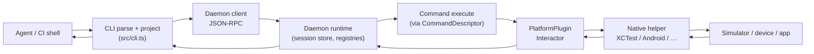

# Research: How agent-device works inside

**Status:** Architecture briefing (primary sources). Complements [`agent-device-assert.md`](agent-device-assert.md) (assert surface) and [`agent-device-cli.md`](agent-device-cli.md) (agent-native CLI usage).

**Primary sources:** [`CONTEXT.md`](https://github.com/callstack/agent-device/blob/main/CONTEXT.md), [ADR index](https://github.com/callstack/agent-device/blob/main/docs/adr/README.md) especially [0003](https://github.com/callstack/agent-device/blob/main/docs/adr/0003-daemon-command-registry.md) / [0008](https://github.com/callstack/agent-device/blob/main/docs/adr/0008-command-descriptor-registry.md) / [0004](https://github.com/callstack/agent-device/blob/main/docs/adr/0004-ios-snapshot-backend-strategy.md) / [0011](https://github.com/callstack/agent-device/blob/main/docs/adr/0011-interaction-guarantee-contract.md) / [0014](https://github.com/callstack/agent-device/blob/main/docs/adr/0014-session-ref-frame-lifetime.md), [Sessions](https://oss.callstack.com/agent-device/docs/sessions), entrypoints `src/bin.ts` / `src/cli.ts` / `src/daemon.ts`.

---

## One-sentence model

**Thin CLI client → long-lived daemon (session + command router) → platform plugins / native helpers (XCTest, Android helper, …) that capture accessibility trees and inject input.** The agent never talks to XCTest/ADB directly; it talks to the `agent-device` binary.

---

## Request path

1. **`src/bin.ts`** — version/help fast paths, or `mcp`, else `runCli`.
2. **CLI** parses flags/grammar, resolves session binding, **`sendToDaemon`** ([`src/cli.ts`](https://github.com/callstack/agent-device/blob/main/src/cli.ts)).
3. **Daemon** (auto-started as needed) owns **Session** state under `~/.agent-device` (or state-dir): open app, snapshots, ref frames, artifacts ([Sessions](https://oss.callstack.com/agent-device/docs/sessions)).
4. **Execute** looks up the command’s **`CommandDescriptor`** and runs the platform path ([ADR 0008](https://github.com/callstack/agent-device/blob/main/docs/adr/0008-command-descriptor-registry.md)).
5. **Platform plugin** talks to a **persistent helper** (e.g. iOS XCTest runner) for capture and taps ([ADR 0002](https://github.com/callstack/agent-device/blob/main/docs/adr/0002-persistent-platform-helper-sessions.md), [ADR 0005](https://github.com/callstack/agent-device/blob/main/docs/adr/0005-ios-runner-interaction-lifecycle.md)).
6. Result returns as compact agent text and/or `--json`; failures become typed errors + exit codes ([ADR 0010](https://github.com/callstack/agent-device/blob/main/docs/adr/0010-error-system.md)).

Cross-process **`invoke` (client) vs `execute` (daemon)** stay distinct — the process boundary is intentional ([ADR 0008](https://github.com/callstack/agent-device/blob/main/docs/adr/0008-command-descriptor-registry.md)).

---

## Two registries (the “perfect shape”)

From [`CONTEXT.md` Architecture](https://github.com/callstack/agent-device/blob/main/CONTEXT.md):

| Registry | Role |
| --- | --- |
| **`CommandDescriptor`** (one per command) | Single declaration → CLI/MCP/batch/capabilities/timeouts/daemon facets **derived** by projection ([ADR 0008](https://github.com/callstack/agent-device/blob/main/docs/adr/0008-command-descriptor-registry.md)) |
| **`PlatformPlugin`** (one per platform family) | Device/OS transport + Interactor; core/daemon avoid `if (ios)` sprawl |

Daemon-only routing/locking/admission lives in the **daemon command registry**, not the public catalog ([ADR 0003](https://github.com/callstack/agent-device/blob/main/docs/adr/0003-daemon-command-registry.md)).

Layering is CI-enforced (`scripts/layering/check.ts`): roughly **kernel/contracts → commands → daemon/client → cli**.

---

## Session, snapshot, refs (why `@e12` works — and breaks)

Vocabulary ([`CONTEXT.md`](https://github.com/callstack/agent-device/blob/main/CONTEXT.md)):

- **Session** — daemon-owned state for a target + opened app/surface.
- **Snapshot** — accessibility (or platform) tree observation for agents.
- **Ref frame** (ADR 0014) — **authorization namespace for mutation `@ref`s**, separate from the latest observation used for selectors/settle.

Critical split ([ADR 0014](https://github.com/callstack/agent-device/blob/main/docs/adr/0014-session-ref-frame-lifetime.md)):

1. Latest observation (`session.snapshot`) — for matching, verify, settle, diagnostics.
2. **Ref frame** — which `@eN` may still be used to **mutate**; has `refsGeneration`, active/expired, complete vs partial issuance.

Mutations **expire** the frame at the side-effect seam; stale `@e12` after navigation is rejected with typed reasons (`ref_frame_expired`, …). Optional pin `@e12~s4` names the generation. That is why help says: after mutate, refresh or use durable selectors.

**`--settle`** — post-action quiet-window re-capture; response carries a **diff** with fresh refs on changed lines (best-effort; `settled: false` + hint if never quiet) ([`CONTEXT.md`](https://github.com/callstack/agent-device/blob/main/CONTEXT.md)).

---

## How a tap / assert hits the device

**Interactor** = semantic API between dispatch and platform behavior ([`CONTEXT.md`](https://github.com/callstack/agent-device/blob/main/CONTEXT.md)).

- Resolve target: `@ref` against **ref frame**, or **selector** against current snapshot.
- Dispatch path (runtime selector, direct iOS selector, coordinates, …) is one cell in the **path × guarantee matrix** ([ADR 0011](https://github.com/callstack/agent-device/blob/main/docs/adr/0011-interaction-guarantee-contract.md)) — typed completeness + golden parity tables so “tap succeeded but UI didn’t change” style gaps are tracked as owned waivers, not folklore.
- Apple: often **semantic resolve → activate at element center coordinates** (avoid XCUIElement.tap re-resolution after navigation); TV is focus/remote-first ([`CONTEXT.md`](https://github.com/callstack/agent-device/blob/main/CONTEXT.md)).
- **`is` / `get` / `wait`** — read/evaluate against snapshot + predicates (`evaluateIsPredicate` in `src/selectors/predicates.ts`); no second “assert engine.”

---

## How iOS (esp.) sees the UI

Snapshots come from the **long-lived XCTest runner**, not from screenshot OCR ([ADR 0004](https://github.com/callstack/agent-device/blob/main/docs/adr/0004-ios-snapshot-backend-strategy.md)):

- Agent-facing interactive snapshot vs raw diagnostic snapshot — different capture plans.
- XCTest can fail/degrade on some trees; quality verdicts make that observable.
- Daemon presentation can filter noise; it **cannot invent nodes XCTest never returned**.

Android uses a bundled snapshot helper APK / persistent session (see Commands docs).

---

## What “inside” means for XQ

- Extending assert honesty (e.g. wait reasons) is **daemon/command/predicate** work upstream — not a new Satellite engine.
- Understanding failures means reading **session artifacts** (`runner.log`, `requests/*.ndjson`, `events.ndjson`) more than inventing wrappers ([Sessions](https://oss.callstack.com/agent-device/docs/sessions)).
- Skill/`xq-qe-box` should stay a **router + pin**; the brains are descriptor → daemon → platform helper.

---

## Sources

- [`CONTEXT.md`](https://github.com/callstack/agent-device/blob/main/CONTEXT.md) · [ADR README](https://github.com/callstack/agent-device/blob/main/docs/adr/README.md)
- ADRs [0003](https://github.com/callstack/agent-device/blob/main/docs/adr/0003-daemon-command-registry.md), [0004](https://github.com/callstack/agent-device/blob/main/docs/adr/0004-ios-snapshot-backend-strategy.md), [0008](https://github.com/callstack/agent-device/blob/main/docs/adr/0008-command-descriptor-registry.md), [0011](https://github.com/callstack/agent-device/blob/main/docs/adr/0011-interaction-guarantee-contract.md), [0014](https://github.com/callstack/agent-device/blob/main/docs/adr/0014-session-ref-frame-lifetime.md)
- [Sessions](https://oss.callstack.com/agent-device/docs/sessions) · `src/bin.ts` / `src/cli.ts` / `src/daemon.ts`
