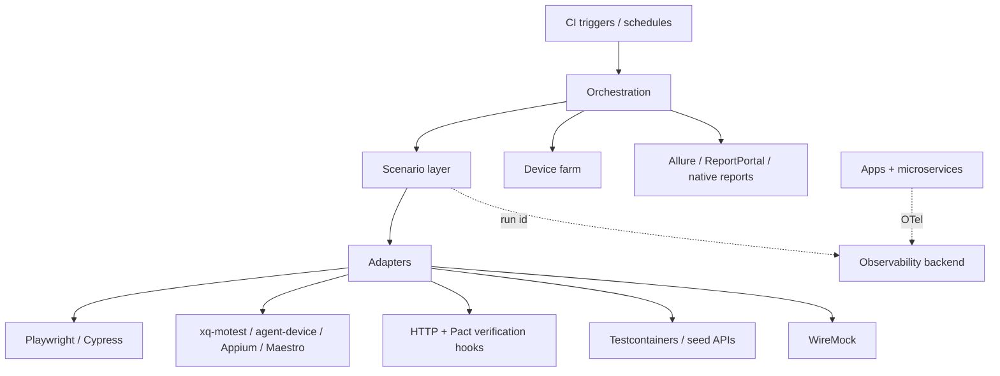

# Research: system test automation platform

**Status:** Research / shaping — primary-source survey; not a Spec.

**Related Hub context:** [`xq-qe-box` Idea](xq-qe-box.md) · [`xq-qe-box` Spec](../specs/xq-qe-box.md) · [`agent-device` CLI research](agent-device-cli.md) · cancelled [`xq-motest-cli`](xq-motest-cli.md)

---

## Intent

How can ExperienceQuality assemble a **test automation platform that serves system tests** across iOS, Android, web, desktop, many microservices, and databases — focusing on architecture for **system / end-to-end / cross-application** testing, not unit testing?

This note surveys **primary sources** (standards glossaries and first-party product docs) and situates findings against existing Hub work: Satellite **`xq-qe-box`** owns agent-native mobile QE (thin DeviceKit-direct CLI `xq-motest` + optional upstream [agent-device](https://github.com/callstack/agent-device)); reinventing a parallel mobile CLI was explicitly cancelled.

---

## 1. Terminology: system vs E2E vs integration

Use ISTQB glossary language unless a Satellite defines its own product terms. Do not treat “E2E,” “system,” and “integration” as synonyms.

| Term | ISTQB sense | Source |
| --- | --- | --- |
| **Test level** | “A specific instantiation of a test process.” | [test level](https://glossary.istqb.org/en_US/term/test-level) |
| **Component testing** | “A test level that focuses on individual hardware or software components.” (synonym: module testing) | [component testing](https://glossary.istqb.org/en_US/term/component-testing) |
| **Integration testing** | “A test level that focuses on interactions between components or systems.” | [integration testing](https://glossary.istqb.org/en_US/term/integration-testing) |
| **System integration testing** | “A test level that focuses on the integration of systems.” | [system integration testing](https://glossary.istqb.org/en_US/term/system-integration-testing) |
| **System testing** | “A test level that focuses on verifying that a system as a whole meets specified requirements.” | [system testing](https://glossary.istqb.org/en_US/term/system-testing) |
| **Acceptance testing** | “A test level that focuses on determining whether to accept the system.” | [acceptance testing](https://glossary.istqb.org/en_US/term/acceptance-testing) |
| **End-to-end testing** | “A test type in which business processes are tested from start to finish under production-like circumstances.” (synonym: E2E testing) | [end-to-end testing](https://glossary.istqb.org/en_US/term/end-to-end-testing) |
| **Test environment** | “An environment containing hardware, instrumentation, simulators, software tools, and other support elements needed to perform a test.” (refs ISO 24765; synonyms: test bed, test rig) | [test environment](https://glossary.istqb.org/en_US/term/test-environment) |
| **Test automation** | “The conversion of test activities to automated operation.” (after ISO 2382) | [test automation](https://glossary.istqb.org/en_US/term/test-automation) |

**Practical distinction for platform design:**

- **System testing** is a *level*: the object under test is the system as a whole against requirements ([ISTQB](https://glossary.istqb.org/en_US/term/system-testing)).
- **E2E** is a *type*: business processes exercised start-to-finish in production-like circumstances ([ISTQB](https://glossary.istqb.org/en_US/term/end-to-end-testing)). A system-test suite may include E2E scenarios; not every system test must be full-journey UI.
- **Integration / system integration** sit below or beside whole-system verification: interactions between components or between systems ([ISTQB](https://glossary.istqb.org/en_US/term/integration-testing), [system integration testing](https://glossary.istqb.org/en_US/term/system-integration-testing)).
- Industry “E2E frameworks” (e.g. Playwright calling itself an “end-to-end test framework” ([Playwright intro](https://playwright.dev/docs/intro)); Cypress describing E2E as visiting the app and acting via the UI ([Cypress](https://docs.cypress.io/app/get-started/why-cypress))) are **tooling for browser journeys**, not replacements for the ISTQB level taxonomy.

The ISO/IEC/IEEE **29119** series defines internationally agreed software-testing concepts and processes; Part 1 (general concepts) is published as [ISO/IEC/IEEE 29119-1:2022](https://www.iso.org/standard/81291.html). Full normative text is paywalled; use ISTQB glossary (CC BY 4.0) for day-to-day Hub language.

**Contract testing is not system testing.** Pact defines contract testing as checking each application *in isolation* against a shared contract, and positions that as an alternative to “expensive and brittle integration tests” that require deploying everything together ([Pact Docs](https://docs.pact.io/)). Keep contracts as a **fast gate for microservice couples**; keep a thinner set of true system/E2E scenarios for cross-surface journeys.

---

## 2. Platform architecture patterns (layers to own or compose)

A durable system-test platform is rarely one runner. Primary sources describe separable concerns:

```
┌─────────────────────────────────────────────────────────────────┐
│ CI / scheduling triggers (GitHub Actions, K8s events, …)        │
├─────────────────────────────────────────────────────────────────┤
│ Orchestration (workflow graph, retries, sharding, multi-tool)   │
├─────────────────────────────────────────────────────────────────┤
│ Scenario / suite layer (business journeys, fixtures, data)      │
├─────────────────────────────────────────────────────────────────┤
│ Adapters (API clients, DB fixtures, service doubles, auth)      │
├─────────────────────────────────────────────────────────────────┤
│ Drivers / clients (Playwright, Appium, XCUITest, Maestro, …)    │
├──────────────┬──────────────────────┬───────────────────────────┤
│ Device / lab │ Environment / deps   │ Observability / reports   │
│ farm         │ (DBs, mocks, envs)   │ (traces, artifacts, TMS)  │
└──────────────┴──────────────────────┴───────────────────────────┘
```

### 2.1 Test runner vs orchestration

- **Runner:** executes a suite for one surface/tool (e.g. Playwright Test bundles runner, assertions, isolation, parallelization ([Playwright](https://playwright.dev/docs/intro))).
- **Orchestration:** schedules *which* suites run *where*, across tools and clusters. [Testkube](https://docs.testkube.io/articles/architecture) separates a **Control Plane** (dashboard, storage, scheduling) from **Agents** in clusters that execute Test Workflows and sync results — tool-agnostic orchestration over Playwright, Cypress, k6, etc. ([Testkube](https://testkube.io/), [architecture](https://docs.testkube.io/articles/architecture)).
- **Durable workflows:** [Temporal Workflows](https://docs.temporal.io/workflows) model long-running step sequences with replay and Activities for external I/O (API calls, DB, file I/O). Useful when a system scenario spans minutes/hours (provision env → seed data → mobile + web steps → teardown) and must survive infra failure — not a substitute for a UI driver.
- **CI as orchestrator:** [GitHub Actions workflows](https://docs.github.com/en/actions/using-workflows/about-workflows) are event-triggered jobs/steps; Playwright’s own CI docs show matrix/sharding, containerized browsers, and deployment-triggered runs against a deployed URL ([Playwright CI](https://playwright.dev/docs/ci)). Adequate for many orgs; weak as a multi-tool “test control plane” unless you build the glue.

### 2.2 Device / lab farm

Remote real-device capacity is a distinct layer from scenario authorship:

- **AWS Device Farm:** “test and interact with your Android, iOS, and web apps on real, physical phones and tablets” hosted by AWS; remote interactive access and managed automated runs (Appium, Android instrumentation, XCTest / XCTest UI, web) ([AWS Device Farm](https://docs.aws.amazon.com/devicefarm/latest/developerguide/what-is-device-farm.html)).
- **BrowserStack App Automate / Automate:** first-party docs describe running Appium/XCUITest/Espresso (and web Selenium/Playwright/Cypress) on cloud devices/browsers with SDK/capabilities configuration ([BrowserStack Docs](https://www.browserstack.com/docs), [App Automate](https://www.browserstack.com/app-automate)).
- **Sauce Labs:** documents automated testing across Selenium/Appium, Espresso/XCUITest, Cypress/TestCafe/Playwright, plus CI integration ([Sauce Labs overview](https://docs.saucelabs.com/overview/)).

Own the **adapter contract** (capabilities, artifact download, session IDs); buy or rent the **farm** unless device diversity and compliance force a private lab.

### 2.3 Environment provisioning

ISTQB’s test environment is hardware + tools + simulators needed to perform a test ([test environment](https://glossary.istqb.org/en_US/term/test-environment)). For microservices:

- **Testcontainers:** “throwaway, lightweight instances of databases, message brokers, web browsers, or just about anything that can run in a Docker container,” declared as code ([Testcontainers](https://testcontainers.com/), [Java docs](https://java.testcontainers.org/)). Strong for **service-level / integration** isolation; less sufficient alone for full multi-app “production-like” E2E.
- **WireMock:** API simulation to stabilize tests, isolate flaky third parties, and simulate APIs that do not exist yet; embeddable or standalone; HTTP and extensions for other protocols ([WireMock docs](https://wiremock.org/docs/), [wiremock.org](https://wiremock.org/)). Community modules exist for Testcontainers-based WireMock containers ([WireMock + Testcontainers](https://wiremock.org/2.x/docs/solutions/testcontainers)).
- **Shared staging / ephemeral envs:** product-specific (not standardized by ISTQB). Trade-off: shared staging matches production topology but suffers contention and data races; ephemeral envs improve isolation at cost of provisioning complexity.

### 2.4 Observability and reporting

- **OpenTelemetry:** instrument apps/systems to emit traces, metrics, logs; backends intentionally out of scope ([What is OpenTelemetry?](https://opentelemetry.io/docs/what-is-opentelemetry/)). For system tests, correlate **test run IDs** with SUT telemetry rather than inventing a parallel observability stack.
- **Allure Report:** framework-agnostic visualization of test results as interactive HTML ([Allure Report Docs](https://allurereport.org/docs/)).
- **ReportPortal:** TestOps service for CI-oriented result analysis, real-time reporting, historical analysis ([ReportPortal docs](https://reportportal.io/docs)).
- Driver-native artifacts remain first-class (e.g. Playwright HTML report / traces ([Playwright](https://playwright.dev/docs/intro)); Cypress Cloud Test Replay ([Cypress](https://docs.cypress.io/app/get-started/why-cypress)); agent-device evidence paths ([agent-device Introduction](https://oss.callstack.com/agent-device/docs/introduction))).

---

## 3. Surface drivers (assemble, do not unify prematurely)

### Web

| Tool | Primary architecture claim | Source |
| --- | --- | --- |
| **W3C WebDriver** | Remote control interface / wire protocol for out-of-process browser automation | [WebDriver](https://www.w3.org/TR/webdriver2/) |
| **Selenium WebDriver** | Drives a browser natively, locally or via Selenium server; implements W3C WebDriver | [Selenium WebDriver](https://www.selenium.dev/documentation/webdriver/) |
| **Playwright** | E2E framework: runner + assertions + isolation + parallelization; Chromium/WebKit/Firefox; mobile *emulation* for Chrome Android / Mobile Safari | [Playwright intro](https://playwright.dev/docs/intro) |
| **Cypress** | Runs in the same run loop as the app (opposite of remote WebDriver architecture); Node process + in-browser execution | [Why Cypress?](https://docs.cypress.io/app/get-started/why-cypress) |

### Mobile (native / hybrid)

| Tool | Primary architecture claim | Source |
| --- | --- | --- |
| **Appium** | Core + **drivers** (platform connectivity) + **clients** (language bindings) + **plugins**; WebDriver-protocol HTTP client/server separation so runners and automation engines stay distinct | [Appium in a Nutshell](https://appium.io/docs/en/latest/intro/) |
| **XCTest / XCUIAutomation** | Apple’s framework for unit, performance, and UI tests in Xcode; UI via XCUIAutomation | [XCTest](https://developer.apple.com/documentation/xctest) |
| **Espresso** | Android UI testing API for concise in-process UI tests | [Espresso](https://developer.android.com/training/testing/espresso) |
| **Maestro** | Black-box UI automation via accessibility layer / YAML flows; “piloting the device, not the app”; mobile and web | [What is Maestro?](https://docs.maestro.dev/get-started/what-is-maestro) |
| **Detox** | Gray-box E2E for React Native: synchronizes with app internals to reduce flakiness vs pure black-box | [Detox Getting Started](https://wix.github.io/Detox/docs/introduction/getting-started) (gray-box overview) |

### Desktop

| Tool | Primary claim | Source |
| --- | --- | --- |
| **Microsoft UI Automation** | Accessibility framework enabling programmatic UI access; “also allows automated test scripts to interact with the UI” | [UI Automation](https://learn.microsoft.com/en-us/windows/win32/winauto/entry-uiauto-win32) |
| **WinAppDriver** | Selenium-like UI automation for UWP, WinForms, WPF, Win32 on Windows 10 | [WinAppDriver README](https://github.com/microsoft/WinAppDriver) |
| **Playwright Electron** | First-party Electron application automation API | [Electron \| Playwright](https://playwright.dev/docs/api/class-electron) |

**Implication:** a multi-surface system platform should expose a **scenario layer** that calls **adapters**, each wrapping a best-fit driver — not force one protocol (WebDriver-only or YAML-only) onto every surface.

---

## 4. Cross-surface coordination (mobile + web + API + DB)

No major vendor documents a single “write once, drive all surfaces” system-test language as a standard. Coordination patterns that *are* grounded in primary sources:

1. **Orchestrated multi-job scenario** — CI/workflow starts env → runs API seed → launches web job and mobile job with shared correlation IDs → asserts via API/DB → tears down. GitHub Actions workflows compose jobs/steps ([GitHub Actions](https://docs.github.com/en/actions/using-workflows/about-workflows)); Temporal Activities wrap external side effects ([Temporal](https://docs.temporal.io/workflows)); Testkube Workflows run heterogeneous tools ([Testkube architecture](https://docs.testkube.io/articles/architecture)).
2. **API as the glue, UI as the witness** — drive business setup/assert through service APIs and DB fixtures; use UI drivers only for surfaces that must prove user-visible behavior. Aligns with keeping expensive E2E thin while contract tests cover service couples ([Pact](https://docs.pact.io/)).
3. **Shared test data / identity** — provision users/tokens once; inject into each surface adapter. (Mechanism is org-specific; platforms only require a fixture/adapter seam.)
4. **Agent-driven exploration vs deterministic suites** — agent-device explicitly keeps intelligence in the agent/harness and acts as “hands, eyes, and evidence collector,” complementing scripted frameworks ([agent-device Introduction](https://oss.callstack.com/agent-device/docs/introduction)). Playwright ships planner/generator/healer **Test Agents** that produce Markdown plans and Playwright tests ([Playwright Test Agents](https://playwright.dev/docs/test-agents)). Use agents for discovery/repair; promote stable paths into deterministic suites.

**Honest gap:** first-party docs do not prescribe a universal “transaction ID across iOS + web + three services” protocol. Correlation is a **platform convention** you must design (headers, OTel baggage, shared run UUID).

---

## 5. Environment strategy

| Strategy | Strength | Cost / risk | Primary anchors |
| --- | --- | --- | --- |
| **Ephemeral containers (Testcontainers)** | Known state; no shared DB pollution; “real” deps without mocks | Docker dependency; not a full multi-app prod topology | [Testcontainers](https://testcontainers.com/) |
| **Service virtualization (WireMock)** | Isolate third parties; simulate missing APIs; fault injection | Divergence from real providers if stubs drift | [WireMock](https://wiremock.org/docs/) |
| **Contract tests (Pact)** | Microservice deploy safety without full deploy | Does not replace whole-system / multi-UI E2E | [Pact](https://docs.pact.io/), [How Pact works](https://docs.pact.io/getting_started/how_pact_works) |
| **Shared staging** | Closest to production-like E2E ([ISTQB E2E](https://glossary.istqb.org/en_US/term/end-to-end-testing)) | Contention, flake, data hygiene | Org infra |
| **Cloud device farm + local/CI browsers** | Device diversity without owning hardware | Vendor lock-in, network path differences | [Device Farm](https://docs.aws.amazon.com/devicefarm/latest/developerguide/what-is-device-farm.html), [BrowserStack](https://www.browserstack.com/docs), [Sauce](https://docs.saucelabs.com/overview/) |

Recommended composition for *system* scope: **contracts + Testcontainers for service graphs**; **thin production-like E2E** on staged/ephemeral full stacks; **virtualize** only unstable or external edges; **never** require a full UI farm for every microservice PR.

---

## 6. Microservices and databases in system tests

From primary sources, a coherent split is:

1. **Consumer–provider contracts (Pact)** — consumer tests against a mock provider generate a pact file; provider verification replays interactions without spinning both services together; message pacts cover async ([How Pact works](https://docs.pact.io/getting_started/how_pact_works)).
2. **DB / broker realism (Testcontainers)** — run Postgres/Kafka/etc. as throwaway containers for data-access and service integration tests ([Testcontainers](https://testcontainers.com/)).
3. **API clients in system scenarios** — HTTP clients against deployed or ephemeral services for seed/assert (pattern used widely; Cypress documents `cy.request` for HTTP alongside UI ([Cypress](https://docs.cypress.io/app/get-started/why-cypress))).
4. **Migrations & fixtures** — apply migrations to ephemeral DBs before scenarios; prefer idempotent seed APIs owned by Satellites over shared mutable staging rows.
5. **Isolation** — prefer per-run namespaces/schemas/tenants; when using shared staging, encode cleanup and unique keys in the scenario layer.

System tests that open every microservice’s DB directly will couple the platform to internal schemas — prefer **public APIs + intentional test hooks** owned by each Satellite.

---

## 7. Agent-native / CLI-first approaches (primary sources)

| Source | What it claims | Fit for system platform |
| --- | --- | --- |
| **callstack agent-device** | Agent-native CLI for inspect/control/verify; intelligence stays in the agent; complements Appium/Maestro/Detox/XCTest/Espresso; optional MCP over installed commands | Mobile (and broader) **agent loops** and evidence; already researched in Hub [`agent-device-cli.md`](agent-device-cli.md); optional path in [`xq-qe-box` Spec](../specs/xq-qe-box.md) |
| **xq-motest (XQ)** | Thin DeviceKit-direct CLI primary path in `xq-qe-box` — not a fork of agent-device internals | Org-owned **deterministic mobile control** for agents/CI without daemon-heavy stack |
| **Playwright MCP** (`microsoft/playwright-mcp`) | MCP server for browser automation via accessibility snapshots; docs contrast MCP (persistent/exploratory loops) vs **CLI + SKILLS** (more token-efficient for coding agents) | Web agent automation; prefer CLI+skills for high-throughput coding agents per upstream guidance |
| **Playwright Test Agents** | Official planner → generator → healer loop producing Playwright tests | Authoring/healing **web** deterministic suites |
| **Cypress Cloud MCP** | Surfaces run/failure context to AI assistants (Cloud product) | Debugging signal, not a multi-surface orchestrator |
| **Maestro** | YAML declarative flows; CLI/Studio/Cloud | Deterministic mobile/web flows; agents can author YAML but Maestro is not “agent intelligence” |

Hub decision already made: **do not reinvent** a mobile agent CLI ([cancelled xq-motest-cli Idea](xq-motest-cli.md)); adopt/compose upstream + thin XQ DeviceKit CLI in **`xq-qe-box`**.

---

## 8. Build vs buy / composition

| Layer | Prefer buy / adopt | Prefer own (thin) | Rationale from sources |
| --- | --- | --- | --- |
| Browser driver + runner | Playwright / Cypress / Selenium | Config, fixtures, page objects / scenario libs | Mature first-party runners ([Playwright](https://playwright.dev/docs/intro), [Cypress](https://docs.cypress.io/app/get-started/why-cypress), [Selenium](https://www.selenium.dev/documentation/webdriver/)) |
| Mobile driver | Appium drivers, Maestro, XCUITest, Espresso, agent-device / xq-motest | Org skills, install pins, selector conventions | Ecosystem is driver-fragmented by design ([Appium](https://appium.io/docs/en/latest/intro/)) |
| Device farm | BrowserStack / Sauce / Device Farm / Maestro Cloud | Capability adapters + secret management | Hosted real devices are their product ([Device Farm](https://docs.aws.amazon.com/devicefarm/latest/developerguide/what-is-device-farm.html)) |
| Service doubles / DBs | WireMock, Testcontainers, Pact | Fixture schemas, provider-state setup | Explicit isolation tools ([WireMock](https://wiremock.org/docs/), [Testcontainers](https://testcontainers.com/), [Pact](https://docs.pact.io/)) |
| Orchestration | GitHub Actions and/or Testkube; Temporal if long-running | Workflow definitions, quality gates, Satellite routing | Control-plane vs agent split is proven ([Testkube](https://docs.testkube.io/articles/architecture)) |
| Reporting | Allure / ReportPortal / vendor dashboards | Correlation IDs, retention policy | Dedicated TestOps products ([Allure](https://allurereport.org/docs/), [ReportPortal](https://reportportal.io/docs)) |
| Observability of SUT | OpenTelemetry + existing backend | Test-run ↔ trace linking convention | OTel leaves backends to other tools ([OTel](https://opentelemetry.io/docs/what-is-opentelemetry/)) |
| Domain scenarios | — | **Own in Satellites** (or a dedicated QE Satellite) | Business journeys are product knowledge |

**Anti-pattern:** building a new universal driver. **Pattern:** own the **scenario + adapter + orchestration contracts**; compose drivers and farms.

---

## 9. Practical reference architecture

Layered model for a multi-app XQ-style estate:

1. **Drivers** — Playwright (web/Electron), Appium or Maestro or XCUITest/Espresso (mobile), WinAppDriver/UIA (Windows desktop), HTTP clients (services).
2. **Adapters** — thin wrappers: `MobileSession`, `WebSession`, `ApiClient`, `DbFixture`, `MockRegistry`; normalize auth, base URLs, artifact dirs, correlation IDs.
3. **Scenarios** — business-process tests (ISTQB E2E type) that call adapters; no raw driver APIs in journey files.
4. **Orchestration** — CI workflows and/or Testkube/Temporal: provision → seed → parallel surface jobs → aggregate → teardown.
5. **CI / quality gates** — PR: contracts + Testcontainers integration; merge/nightly: selected system/E2E on staging or ephemeral full stack + device farm matrix.
6. **Agent lane (optional)** — skills routing to `xq-motest` / `agent-device` / Playwright CLI or MCP for exploratory QA and evidence; promote survivors into scenarios.



---

## 10. Gaps and trade-offs (do not overclaim)

- **No single primary standard** defines a “system test automation platform” product architecture; ISO 29119 covers testing concepts/processes ([29119-1:2022](https://www.iso.org/standard/81291.html)), not a tool stack.
- **Cross-surface atomicity** (one user journey spanning iOS + web + multiple services with transactional rollback) is largely **custom engineering**.
- **Cypress architecture** (in-browser) vs **WebDriver/Playwright** (out-of-process) implies different stubbing and multi-tab/multi-origin capabilities — choose per product, not by slogan ([Cypress architecture](https://docs.cypress.io/app/get-started/why-cypress), [WebDriver](https://www.w3.org/TR/webdriver2/)).
- **Detox gray-box** vs **Maestro/Appium black-box** vs **agent-device agent loops** optimize different variables (sync reliability vs zero instrumentation vs agent flexibility).
- **WinAppDriver** is a Microsoft GitHub project for Windows UI tests ([WinAppDriver](https://github.com/microsoft/WinAppDriver)); treat desktop as a first-class adapter only if XQ ships Windows clients — do not assume parity with web/mobile ecosystems.
- **Playwright “mobile”** in core docs is often **emulation**, not a replacement for real-device farms ([Playwright intro](https://playwright.dev/docs/intro)).
- Vendor marketing (AI self-healing, etc.) is out of scope here unless tied to documented APIs.

---

## 11. Implications for XQ

Sit this research next to existing Hub decisions — do not contradict them:

1. **`xq-qe-box` is the QE Satellite foothold**, not a full multi-surface control plane yet. Spec scope: DeviceKit-direct `xq-motest`, skills, optional agent-device; out of scope today: MCP packaging, per-app CI matrices, `xq-qe` wrapper ([xq-qe-box Spec](../specs/xq-qe-box.md)).
2. **System-test platform ≠ new mobile CLI.** Mobile agent control is adoption + thin XQ CLI ([agent-device research](agent-device-cli.md), cancelled reinvent Idea). Platform work, if pursued, should add **orchestration, adapters, env, reporting**, and **web/API/DB** lanes.
3. **Hub language:** package further work as Idea → Spec → Tickets aimed at Satellites (`satellite:xq-qe-box` and product Satellites). Avoid treating the Hub repo itself as a runtime “platform” ([CONTEXT.md](../../CONTEXT.md)).
4. **Sensible next shaping questions** (not Tickets yet):
   - Which journeys are true **system/E2E** vs covered by **Pact + Testcontainers**?
   - Who owns the **scenario repo** — `xq-qe-box` vs a new Satellite vs per-product Satellites?
   - Orchestration: **GitHub Actions only** vs Testkube/Temporal when multi-tool workflows grow?
   - Device farm: vendor vs private lab given compliance?
   - How should agent loops (`xq-motest` / agent-device / Playwright agents) **promote** into deterministic CI suites?

---

## Sources

### Standards / glossary
- [ISTQB Glossary](https://glossary.istqb.org/) (terms linked inline; V4.7.2, CC BY 4.0)
- [ISO/IEC/IEEE 29119-1:2022](https://www.iso.org/standard/81291.html)

### Web / protocol
- [W3C WebDriver](https://www.w3.org/TR/webdriver2/)
- [Selenium WebDriver](https://www.selenium.dev/documentation/webdriver/)
- [Playwright intro](https://playwright.dev/docs/intro) · [CI](https://playwright.dev/docs/ci) · [Test Agents](https://playwright.dev/docs/test-agents) · [Electron](https://playwright.dev/docs/api/class-electron)
- [microsoft/playwright-mcp](https://github.com/microsoft/playwright-mcp)
- [Cypress — Why Cypress?](https://docs.cypress.io/app/get-started/why-cypress)

### Mobile / desktop
- [Appium in a Nutshell](https://appium.io/docs/en/latest/intro/)
- [Apple XCTest](https://developer.apple.com/documentation/xctest)
- [Android Espresso](https://developer.android.com/training/testing/espresso)
- [Maestro — What is Maestro?](https://docs.maestro.dev/get-started/what-is-maestro)
- [Detox Getting Started](https://wix.github.io/Detox/docs/introduction/getting-started)
- [agent-device Introduction](https://oss.callstack.com/agent-device/docs/introduction)
- [Microsoft UI Automation](https://learn.microsoft.com/en-us/windows/win32/winauto/entry-uiauto-win32)
- [WinAppDriver](https://github.com/microsoft/WinAppDriver)

### Env / contracts / orchestration / farms / reporting
- [Testcontainers](https://testcontainers.com/) · [Java](https://java.testcontainers.org/)
- [WireMock docs](https://wiremock.org/docs/) · [WireMock + Testcontainers](https://wiremock.org/2.x/docs/solutions/testcontainers)
- [Pact Docs](https://docs.pact.io/) · [How Pact works](https://docs.pact.io/getting_started/how_pact_works)
- [Testkube architecture](https://docs.testkube.io/articles/architecture) · [Testkube](https://testkube.io/)
- [Temporal Workflows](https://docs.temporal.io/workflows)
- [GitHub Actions — Workflows](https://docs.github.com/en/actions/using-workflows/about-workflows)
- [AWS Device Farm](https://docs.aws.amazon.com/devicefarm/latest/developerguide/what-is-device-farm.html)
- [BrowserStack Docs](https://www.browserstack.com/docs) · [App Automate](https://www.browserstack.com/app-automate)
- [Sauce Labs Documentation](https://docs.saucelabs.com/overview/)
- [OpenTelemetry — What is OpenTelemetry?](https://opentelemetry.io/docs/what-is-opentelemetry/)
- [Allure Report Docs](https://allurereport.org/docs/)
- [ReportPortal docs](https://reportportal.io/docs)

### Hub
- [CONTEXT.md](../../CONTEXT.md)
- [xq-qe-box Idea](xq-qe-box.md) · [xq-qe-box Spec](../specs/xq-qe-box.md)
- [agent-device CLI research](agent-device-cli.md) · [xq-motest-cli (cancelled)](xq-motest-cli.md)
